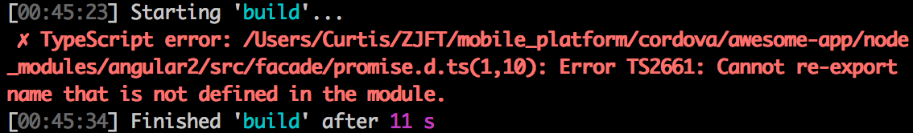
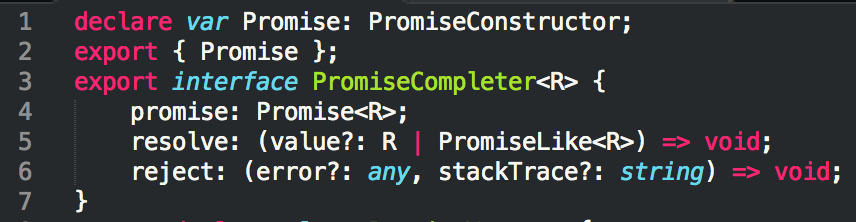

# Ionic 2.0 & cordova 踩坑实录

## 工程创建
### Issue 

1. permissions

  + subscribe
  
    npm permissions

  + solve

    ```
    sudo chown -R $(whoami) $(npm config get prefix)/{lib/node_modules,bin,share}
    ```

2. Error TS2661

  + subcribe
    ```
  TypeScript error: node_modules/angular2/src/facade/promise.d.ts(2,10): 
  Error TS2661: Cannot re-export name that is not defined in the module.
    ```

  + solve:
  
    adding 
    ```
    declare var Promise: PromiseConstructor;
    ```
     on the top of promise.d.ts
     
3. Cordova-lib execution

  + subscribe
  ```
    An Error occurred trying to fall back to Cordova-lib execution: TypeError:
Cannot read property 'then' of undefined
  ```
  
  + solve

     ```
    sudo chmod -R 777 ~/.config
    ```
    或者

    ```
    sudo chown -R $(whoami) ~/.config
    ```

### Installation

#### 环境准备

1. OS: OS X EI Capitan x64
2. node version：v5.9.1
3. npm version：3.7.3
4. tsc version：1.8.9

下载：[nodejs](https://nodejs.org/en/)

#### 修复npm权限

在控制台中输入：
```
sudo chown -R $(whoami) $(npm config get prefix)/{lib/node_modules,bin,share}
```

有关npm权限的更多细节，详见[fixing npm perssions](https://docs.npmjs.com/getting-started/fixing-npm-permissions)

#### 安装ionic beta版

为了安装Ionic SDK和创建Ionic 2工程，我们需要安装最新的ionic2的beta发行版：

```
$ npm install -g ionic@beta
```

#### 创建ionic app

上述的工作完成，就可以创建ionic app：

```
$ ionic start awesome-app --v2
```

如果你想创建`Typescript`工程，只需要

```
$ ionic start awesome-app --v2 --typescript
```

我们可以`cd`转入`awesome-app`目录下执行`ionic serve`命令：

```
$ cd awesome-app
```
then
```
$ ionic serve
```
然后就可以在浏览器中查看效果。这里需要注意的是，在此处会发生异常：



需要添加

```
declare var Promise: PromiseConstructor;
```
到`node_modules/angular2/src/facade/promise.d.ts`文件的头部：



#### cordova

当安装好ionic后，就可以构建自己的app应用到物理设备上了。如果手边没有物理设备，你依然可以部署到设备模拟器上。运行：

```
$ sudo npm install -g cordova
```

1. building for iOS

2. building for android